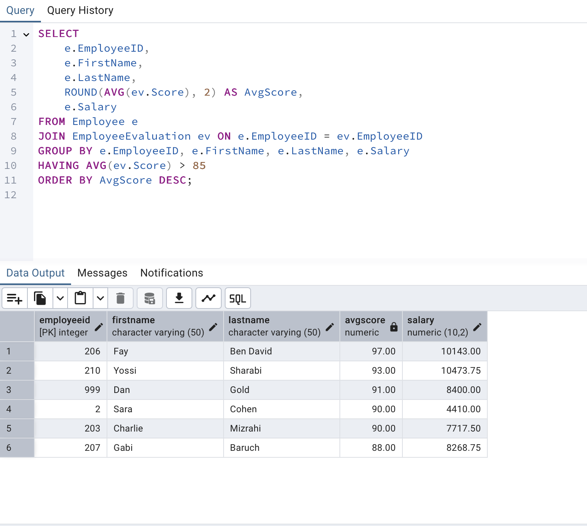

# דוח פרויקט – שלב ד: תכנות (PL/pgSQL)

בשלב זה נכתבו מספר תוכניות על בסיס הנתונים לאחר האינטגרציה. כל תוכנית כוללת תיאור, קוד, ותיעוד הפעלה מוצלח באמצעות צילום מסך או תוצאה מהדאטהבייס.

---

## ✅ פונקציה 1: GetUntrainedEmployees

**תיאור:**  
הפונקציה מחזירה את רשימת כל העובדים שמעולם לא עברו הכשרה. הפלט הוא טבלת תוצאות עם מזהה, שם פרטי ושם משפחה.

**קוד:**
```sql
CREATE OR REPLACE FUNCTION GetUntrainedEmployees()
RETURNS TABLE(EmployeeID INT, FirstName TEXT, LastName TEXT) AS $$
BEGIN
    RETURN QUERY
    SELECT e.EmployeeID, e.FirstName, e.LastName
    FROM Employee e
    WHERE NOT EXISTS (
        SELECT 1 FROM EmployeeTraining t WHERE t.EmployeeID = e.EmployeeID
    );
END;
$$ LANGUAGE plpgsql;
```

**הוכחת הפעלה:**  

---

## ✅ פונקציה 2: GetEmployeeAvgScore

**תיאור:**  
מקבלת מזהה עובד ומחזירה את ממוצע הציונים שלו מכל ההערכות שקיבל.

**קוד:**
```sql
CREATE OR REPLACE FUNCTION GetEmployeeAvgScore(emp_id INT)
RETURNS NUMERIC AS $$
DECLARE
    avg_score NUMERIC;
BEGIN
    SELECT AVG(Score)
    INTO avg_score
    FROM EmployeeEvaluation
    WHERE EmployeeID = emp_id;

    RETURN avg_score;
END;
$$ LANGUAGE plpgsql;
```

**הוכחת הפעלה:**  
.png)

---

## ✅ פרוצדורה 1: RaiseHighPerformerSalaries

**תיאור:**  
הפרוצדורה מעלה את השכר ב־10% לעובדים שקיבלו לפחות ציון 90 באחת ההערכות.

**קוד:**
```sql
CREATE OR REPLACE PROCEDURE RaiseHighPerformerSalaries()
LANGUAGE plpgsql
AS $$
BEGIN
    UPDATE Employee
    SET Salary = Salary * 1.10
    WHERE EmployeeID IN (
        SELECT DISTINCT EmployeeID
        FROM EmployeeEvaluation
        WHERE Score >= 90
    );
END;
$$;
```
**Proof of Execution:**  


---

## ✅ פרוצדורה 2: ReduceSalaryForLowScores

**תיאור:**  
פרוצדורה שמפחיתה את השכר ב־15% לעובדים שממוצע ההערכות שלהם נמוך מ־60.

**קוד:**
```sql
CREATE OR REPLACE PROCEDURE ReduceSalaryForLowScores()
LANGUAGE plpgsql
AS $$
BEGIN
    UPDATE Employee
    SET Salary = Salary * 0.85
    WHERE EmployeeID IN (
        SELECT EmployeeID
        FROM (
            SELECT EmployeeID, AVG(Score) AS avg_score
            FROM EmployeeEvaluation
            GROUP BY EmployeeID
        ) sub
        WHERE avg_score < 60
    );
END;
$$;
```

**הוכחת הפעלה:**  
before: screenshots/p2_before.png
after: screenshots/p2_after.png

---

## טריגר 1: עדכון תאריך השתלמות אחרון

**תיאור:**  
טריגר המדפיס הודעה לקונסול בעת הוספת אירוע חדש.

**קוד:**
```sql
CREATE OR REPLACE FUNCTION UpdateLastTrainingDate()
RETURNS TRIGGER AS $$
BEGIN
    UPDATE Employee
    SET LastTrainingDate = NEW.TrainingDate
    WHERE EmployeeID = NEW.EmployeeID;
    RETURN NEW;
END;
$$ LANGUAGE plpgsql;

CREATE TRIGGER trg_UpdateLastTrainingDate
AFTER INSERT ON EmployeeTraining
FOR EACH ROW
EXECUTE FUNCTION UpdateLastTrainingDate();

```

---

## ✅ טריגר 2: אזהרה על מחיקת עובד מצטיין

**תיאור:**  
טריגר שמציג הודעה לפני מחיקת עובד בעל ציון ממוצע מעל 85.

**קוד:**
```sql
CREATE OR REPLACE FUNCTION WarnBeforeDeletingTopEmployee()
RETURNS TRIGGER AS $$
DECLARE
    avg_score NUMERIC;
BEGIN
    SELECT AVG(Score)
    INTO avg_score
    FROM EmployeeEvaluation
    WHERE EmployeeID = OLD.EmployeeID;

    IF avg_score > 85 THEN
        RAISE NOTICE 'Warning: You are deleting a high-performing employee (ID: %)', OLD.EmployeeID;
    END IF;
    RETURN OLD;
END;
$$ LANGUAGE plpgsql;

CREATE TRIGGER Trigger_WarnBeforeDelete
BEFORE DELETE ON Employee
FOR EACH ROW
EXECUTE FUNCTION WarnBeforeDeletingTopEmployee();
```

**הוכחת הפעלה:**  


---

## `main_program_1.sql`

**תיאור:**  
מריצה את הפונקציה `GetUntrainedEmployees` ומבצעת העלאת שכר למצטיינים.

---

## main_program_2.sql

**תיאור:**  
מריצה את `GetEmployeeAvgScore` לעובד אחד, ומבצעת הפחתת שכר לעובדים בעלי ציונים נמוכים.


