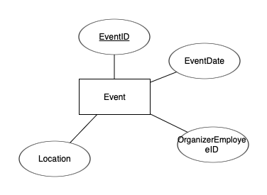
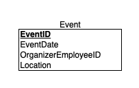

# דוח פרויקט – שלב ג – אינטגרציה ומבטים

## 🧑‍🤝‍🧑 שמות חברי הצוות:
- איתן לטס  
- ישי תירם  

## 🗂️ המערכת: ניהול מלון – אינטגרציה עם מערכת אירועים

---

## תוכן עניינים

1. [ERD + DSD – של הטבלה החדשה](#erd--dsd--של-הטבלה-החדשה)
2. [ERD משולב](#erd-משולב)
3. [החלטות אינטגרציה](#החלטות-אינטגרציה)
4. [הסבר על השינויים שנעשו בטבלאות](#הסבר-על-השינויים-שנעשו-בטבלאות)
5. [המבטים שנוצרו](#המבטים-שנוצרו)
6. [שאילתות על מבטים](#שאילתות-על-מבטים)

---

## ERD + DSD – של הטבלה החדשה

הוספנו טבלה חדשה בשם `Event`, המתארת אירועים המנוהלים ע"י עובדי המלון.

📷 צילום מסך של ERD הטבלה החדשה:


📷 צילום מסך של DSD הטבלה החדשה:


---

## ERD משולב

📷 צילום מסך של ERD הכולל את מערכת העובדים ואת טבלת האירועים:


📷 צילום מסך של DSD לאחר האינטגרציה:


---

## החלטות אינטגרציה

1. לא שינינו את הטבלאות הקיימות אלא הוספנו את טבלת `Event` עם קשר ל-`Employee` דרך השדה `OrganizerEmployeeID`.
2. יצרנו קשר זר (Foreign Key) מטבלת `Event` ל-`Employee`.
3. ביצענו התאמת נתונים כך שלכל מזהה עובד ב-`Event` קיים עובד אמיתי ב-`Employee`.

---

## הסבר על השינויים שנעשו בטבלאות

השינוי היחיד שנעשה היה:
```sql
ALTER TABLE Event
ADD CONSTRAINT fk_event_organizer
FOREIGN KEY (OrganizerEmployeeID) REFERENCES Employee(EmployeeID);
```

---

## המבטים שנוצרו

### 🔍 View 1 – EmployeeEventsView

מבט המציג מידע על אירועים והעובדים שארגנו אותם.

```sql
CREATE VIEW EmployeeEventsView AS
SELECT 
    e.EmployeeID,
    e.FirstName,
    e.LastName,
    ev.EventID,
    ev.EventTitle,
    ev.EventDate,
    ev.Location
FROM Event ev
JOIN Employee e ON ev.OrganizerEmployeeID = e.EmployeeID;
```

---

### 🔍 View 2 – EmployeeWithDepartmentView

מבט המציג עובדים יחד עם שם המחלקה שלהם.

```sql
CREATE VIEW EmployeeWithDepartmentView AS
SELECT 
    e.EmployeeID,
    e.FirstName,
    e.LastName,
    e.Position,
    d.DepartmentName
FROM Employee e
JOIN Department d ON e.DepartmentID = d.DepartmentID;


---

## שאילתות על מבטים

### 🟢 שאילתות על EmployeeEventsView

#### 1. כל האירועים שמאורגנים באוגוסט
```sql
SELECT * FROM EmployeeEventsView
WHERE EXTRACT(MONTH FROM EventDate) = 8;
```
שלב ג/view1.csv


#### 2. מספר אירועים לכל עובד
```sql
SELECT EmployeeID, FirstName, LastName, COUNT(*) AS EventCount
FROM EmployeeEventsView
GROUP BY EmployeeID, FirstName, LastName;
```
שלב ג/view1.csv
---

### 🟢 שאילתות על EmployeeWithDepartmentView

#### 1. עובדים ששייכים למחלקת HR
```sql
SELECT * FROM EmployeeWithDepartmentView
WHERE DepartmentName = 'HR';
```

שלב ג/view2.csv

#### 2. כמות עובדים בכל מחלקה
```sql
SELECT DepartmentName, COUNT(*) AS EmployeeCount
FROM EmployeeWithDepartmentView
GROUP BY DepartmentName;
```

שלב ג/view2.csv

---

## ✔️ סיכום

בשלב זה ביצענו אינטגרציה עם מערכת חיצונית תוך שמירה על מבנה הטבלאות הקיים. הוספנו טבלה חדשה, יצרנו קשרים מתאימים, ובנינו מבטים משמעותיים עם שאילתות תואמות. כל התהליך מגובה בצילומי מסך, פקודות SQL, וקובצי גיבוי.
